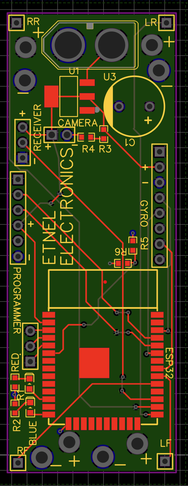

# ESP32 Quadcopter Flight Controller

[](https://youtube.com/shorts/f9YyxP76PeM?si=TOA23_4xL6wEHEzO)

An advanced, compact 4-axis flight controller built entirely around the ESP32 microcontroller. This project features a custom-designed 4-layer printed circuit board (PCB), real-time PID stabilization, I-Bus radio protocol decoding, and live telemetry/tuning over Bluetooth.

---

## 🚀 Key Features

* **Custom 4-Layer PCB:** Designed with dedicated Ground (GND), Power, and two data routing layers to optimize space and minimize signal interference.
* **6-Axis Inertial Navigation:** Utilizes the MPU6050 IMU to calculate high-precision tilt angles (Pitch/Roll) and angular velocity via its internal Digital Motion Processor (DMP).
* **Real-Time Bluetooth Tuning:** Dynamically adjust PID coefficients and request battery voltage monitoring on-the-fly using a Bluetooth terminal application.
* **I-Bus Protocol Receiver Integration:** Decodes multichannel inputs from a FLY-SKY FS-i6X radio transmitter natively over hardware UART.
* **Robust Hardware Safety Suite:** Features an angle-based emergency cutoff mechanism (kills motors if tilt exceeds 45°) and a dedicated switch-arm safety sequence.
* **Integrated Battery Monitoring:** Employs an onboard resistor voltage divider for real-time low-voltage detection.

---

## 🛠️ Hardware Architecture

### Component Breakdown
* **Microcontroller:** ESP32-WROOM-32D-N16
* **IMU Sensor:** MPU6050 Module
* **RC Receiver:** FLY-SKY FS-i6X (I-Bus compatible)
* **Actuators:** 4x Brushless DC Motors with Electronic Speed Controllers (ESCs)
* **Power Supply:** 4S Li-Po Battery (1550 mAh) stepped down via a DC-DC buck converter

### Pin Mapping Configurations

| Peripheral Component | ESP32 Pin | Function Description |
| :--- | :---: | :--- |
| **ESC Left-Front (LF)** | IO18 | PWM Motor Control Output |
| **ESC Left-Rear (LR)** | IO0 | PWM Motor Control Output |
| **ESC Right-Front (RF)** | IO5 | PWM Motor Control Output |
| **ESC Right-Rear (RR)** | IO4 | PWM Motor Control Output |
| **I-Bus RX Pin** | IO16 | Hardware Serial UART2 Input |
| **MPU6050 Interrupt** | IO2 | IMU Data Ready Trigger |
| **Voltage Divider Sense** | IO34 | Analog Battery Telemetry Input |
| **Status LED** | IO12 | Visual Indicator |

---

## 💻 Software Implementation

The software relies on high-speed sampling of the IMU's raw angular metrics combined with pilot stick mapping to dictate corrective motor speeds via localized mixing equations.

### Motor Mixing Matrix Logic

```cpp
LF = boolKill * (T * throttle + 0.1 * P * (ROLL + Rstick * S) + 0.1 * P * (PITCH - Pstick * S) + 0.001 * D * gy + 0.001 * D * gx + I * I_PITCH + I * I_ROLL + Y * Ystick);
LR = boolKill * (T * throttle + 0.1 * P * (ROLL + Rstick * S) - 0.1 * P * (PITCH - Pstick * S) + 0.001 * D * gy - 0.001 * D * gx - I * I_PITCH + I * I_ROLL - Y * Ystick);
RF = boolKill * (T * throttle - 0.1 * P * (ROLL + Rstick * S) + 0.1 * P * (PITCH - Pstick * S) - 0.001 * D * gy + 0.001 * D * gx + I * I_PITCH - I * I_ROLL - Y * Ystick);
RR = boolKill * (T * throttle - 0.1 * P * (ROLL + Rstick * S) - 0.1 * P * (PITCH - Pstick * S) - 0.001 * D * gy - 0.001 * D * gx - I * I_PITCH - I * I_ROLL + Y * Ystick);
```

### Remote Bluetooth CLI Commands
By pairing with the system via Bluetooth (`ProjectX`), you can pass live terminal strings configured as `[Command]|[Value]\n` to tweak handling metrics or review vital diagnostics:

* `P|[value]` - Set Proportional Gain
* `I|[value]` - Set Integral Gain
* `D|[value]` - Set Derivative Gain
* `T|[value]` - Set Throttle Scale
* `B` - Echoes real-time 4S battery voltage metrics

---

## 🖼️ Hardware Layout Visuals

### PCB Trace Routing View
Below is a render of the compact routing layout engineered specifically for this flight controller:


